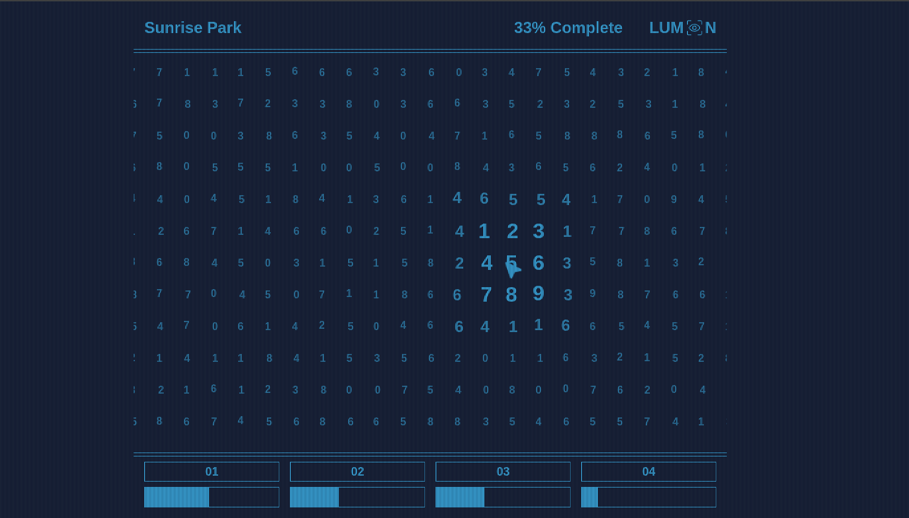

<div align="center">


# Micro Data Recognition (MDR)



</div>

## Overview

This project showcases a pattern recognition game inspired by the Apple TV+ series [_"Severance"_](<https://wikipedia.org/wiki/Severance_(TV_series)>).
Unlike the show's macro data refinement based on emotional response, this game focuses on logical deductions through mathematical patterns.

As someone who enjoys solving Sudoku puzzles, playing number games and exploring experimental ideas, _MDR_ combines all those elements. The goal is to train your brain to detect hidden patterns in randomly generated datasets.

## Concept

In the world of Lumon Industries, employees on the severed floor work with mysterious data.
This game reimagines that concept by challenging players to identify and manipulate mathematical patterns within a large grid divided into subgrids(3x3, 2x3, 2x4, ...).

Each subgrid contains a specific mathematical pattern such as:
- Linear sequences
- Fibonacci numbers
- Prime numbers
- Square numbers
- ... and more.

## Live Demo

- [**Launch**](https://henryhale.github.io/mdr/) :rocket: - _(for desktop use only)_

## Gameplay

You are presented with a grid of single-digit numbers. Your task is to identify and select numbers that belong to hidden mathematical patterns.

1. Examine the grid
2. Identify the pattern in each subgrid
3. Select a subgrid to "refine" (empty and refill with a new pattern)
4. Continue identifying and refining patterns

[demo.webm](https://github.com/user-attachments/assets/3cd225bc-31c0-4e95-986a-c83a2346dd72)

The goal is to train your pattern recognition skills much like the severed employess of Lumon Industries train their intuition to refine data.

## Roadmap

- [x] Game layout and theme
- [x] Game levels
- [x] Pattern generation logic
- [x] Layered grid structure
- [x] Random number movements
- [x] Loading screen
- [x] Horizontal scrolling
- [x] Sound effects & Background audio
- [x] Game over display
- [ ] Number drop animations
- [ ] Retro-style font
- [ ] Advanced pattern sets
- [ ] Accessibility improvements

## Technical Implementation

This game is built with Vanilla TypeScript and Tailwind CSS, with no external dependencies. 

**Components**: Here is how it is made;

- The game grid consists of multiple **layers** stacked together.
- Each layer includes one or more **pattern-based subgrids** with increasing complexity.
- Layers are merged into one visible grid, where **top layers take visual precedence**, like overlapping transparent cards.

**Rules & Scoring**:

- **Correct selection** of a full subgrid on the topmost visible layer awards points.
- Once a valid pattern is cleared, it either reveals lower layers or is replaced with random digits.
- **Incorrect selections have no penalty**, but they create cognitive confusion—challenging your focus.

**Win Condition**:

- All subgrids in every layer must be correctly identified and cleared.
- Final grid should contain only random, patternless numbers.
- Game progress must reach **100%** to win a level.

## Getting Started

**Preresquisites**:

- Node.js (v22+)
- Typescript (v5)

**Installation procedure**:

> For local development or offline play:

1. Clone the repository:
   ```bash
   git clone https://github.com/henryhale/mdr.git
   ```
2. Install dependencies:
   ```bash
   cd mdr
   pnpm install
   ```
3. Run development server:
   ```bash
   pnpm dev
   ```
4. Open `http://localhost:5173` in a modern web browser to play.

## Contributing

Contributions, feature ideas, and bug reports are welcome. Please feel free to submit a pull request.

**To contribute:**

1. Fork the repository
   ```bash
   git clone https://github.com/henryhale/mdr.git
   ```
2. Create a new branch:
   ```bash
   git checkout -b feature-name
   ```
3. Commit changes:
   ```bash
   git commit -m "Add feature"
   ```
4. Push and open a pull request

## Credits

The game concept is inspired by the Macro Data Refinement department from Apple TV+ series - [Severance](<https://wikipedia.org/wiki/Severance_(TV_series)>). It is created as a fan project with no affiliation to Apple or the show creators.

## License

Released under [MIT License](./LICENSE.txt), &copy; 2025 [Henry Hale](https://github.com/henryhale).
